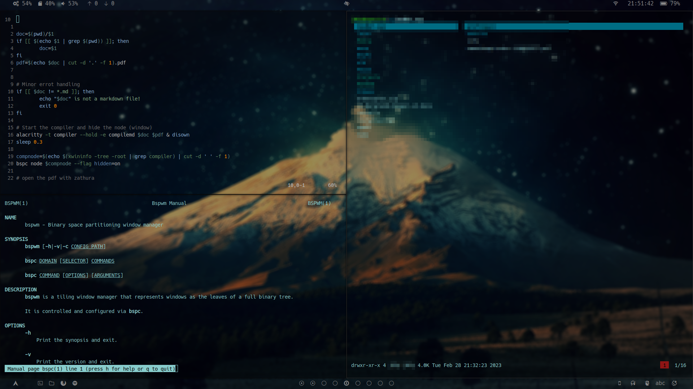

# Archer
Archer is my own configuration of Arch linux. I built this system from the ground up, piecing it together from some minimal yet configurable software I could find.

---

---

# My workflow

My everyday workflow is very keyboard-centric. I find using the keyboard and keyboard-based applications much faster and smoother. Due to this my system can be quite difficult to use if you aren't me, since I access all my apps through keybinds that I've memorized. I think this is the best way for someone to use their computer, so I encourage anyone who's reading this to take inspiration from my setup and personalize and optimize your own workflow. 

---

# Programs

Here is some of the software that make up my OS:

## System and environment

- Compositor: Picom
- WM: bspwm
- Bar: Polybar
- Hotkey manager: sxhkd
- Face-ID software: Howdy
- Wallpaper setter: xwallpaper
- Audio controller: Pulseaudio
- Shell: Zsh
- Autoratation: A forked autorotation script that I adapted for my 2-in-1 laptop

## Applications

- Terminal emulator: Alacritty
- Browser: Firefox, Qutebrowser
- File manager: LF
- Text editor: Vim, VS Codium
- Image viewer: sxiv
- PDF reader: Zathura
- Media player: mpv, Spotify
- Chatting: Discord, Signal-desktop
- Email client: neomutt
- App launcher: My own fzf-menu script (dmenu/rofi but with fzf)

